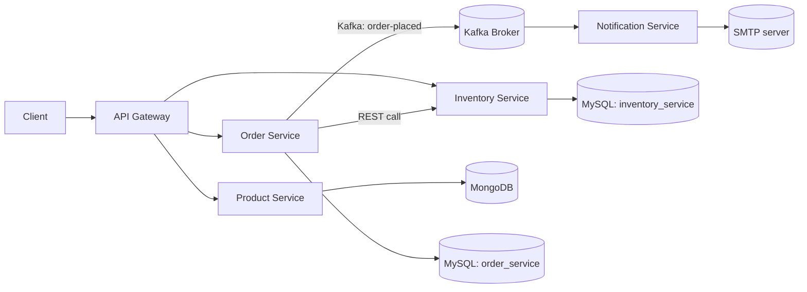
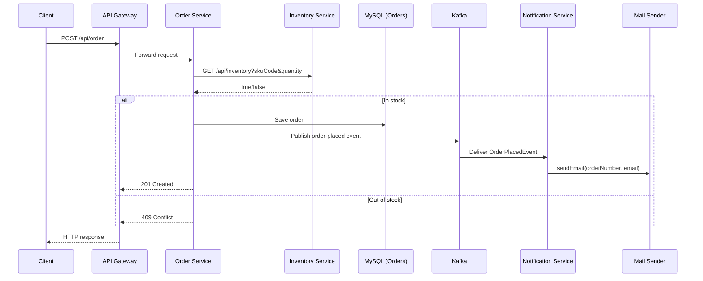
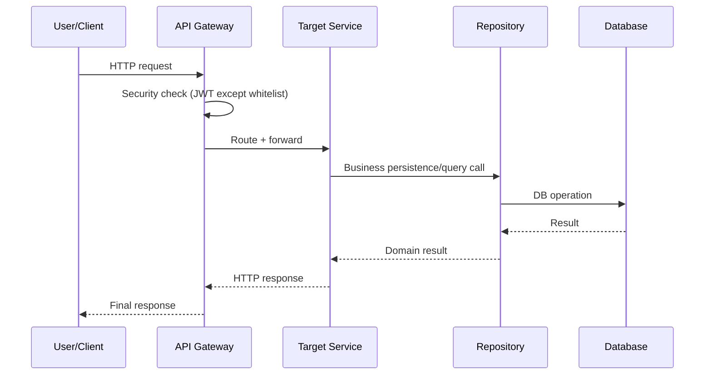

# Microservice Project (Spring Shop Backend)

> A Spring Boot microservices system for product catalog, inventory checks, order placement, and order-notification emails via Kafka.

## 1. Project Overview

This repository contains a multi-service backend split into independently deployable Spring Boot applications:

- **api-gateway**: entry point and route aggregation
- **product-service**: product catalog CRUD subset (create + list)
- **inventory-service**: stock availability lookup
- **order-service**: order creation + inventory verification + event publishing
- **notification-service**: consumes order events and sends confirmation emails

The architecture separates concerns by business capability (catalog, stock, ordering, notifications), allowing each service to evolve independently with its own storage and dependencies.

## 2. Key Features

Implemented features observed in code:

- API Gateway route forwarding for product, order, and inventory APIs
- Gateway-level JWT resource-server security (authenticated by default)
- Product creation and product listing APIs
- Inventory stock-check API by SKU and quantity
- Order placement API with stock verification before persistence
- REST-based service-to-service communication (`order-service` → `inventory-service`)
- Event-driven notification flow (`order-service` publishes Kafka event, `notification-service` consumes)
- Email confirmation sending after order event consumption
- Database persistence:
  - MongoDB for products
  - MySQL for inventory and orders
- Flyway SQL migrations for MySQL-backed services
- OpenAPI bean configuration in gateway, product, inventory, and order services
- Integration-style tests using Spring Boot Test, Testcontainers, Rest Assured, and WireMock (service-dependent)

## 3. Architecture

### 3.1 High-Level Architecture



### 3.2 Gateway Routing (from `Routes.java`)

| Incoming Path | Target URI | Notes |
|---|---|---|
| `/api/product/**` | `http://localhost:8080` | Circuit breaker + fallback |
| `/api/order/**` | `http://localhost:8081` | Circuit breaker + fallback |
| `/api/inventory/**` | `http://localhost:8082` | Circuit breaker + fallback |
| `/aggregate/product-service/api-docs` | `http://localhost:8080/api-docs` | Swagger aggregation route |
| `/aggregate/order-service/api-docs` | `http://localhost:8081/api-docs` | Swagger aggregation route |
| `/aggregate/inventory-service/api-docs` | `http://localhost:8082/api-docs` | Swagger aggregation route |
| `/fallbackRoute` | local gateway handler | returns `503 Service Unavailable` |

## 4. System Workflow

### 4.1 Generic Request Lifecycle (Gateway-routed)

```text
Client
  ↓
API Gateway
  ↓
Gateway SecurityFilterChain (JWT resource server)
  ↓
Route matching (/api/product/**, /api/order/**, /api/inventory/**)
  ↓
Target service controller
  ↓
Service layer
  ↓
Repository layer
  ↓
Database
  ↓
HTTP response to client
```

### 4.2 What Happens at Each Step

1. Client sends HTTP request to gateway.
2. Gateway checks if route is public (`/swagger-ui/**`, `/api-docs/**`, `/aggregate/**`) or requires authentication.
3. For protected routes, gateway requires authenticated JWT token.
4. Gateway forwards request to configured downstream URI.
5. Target microservice controller receives request and invokes service class.
6. Service executes business logic and repository interaction.
7. Service returns data/state to controller.
8. Controller returns HTTP response.
9. If downstream service fails at gateway level, circuit breaker fallback returns 503 with message.

## 5. Detailed Workflows for Major Features

### 5.1 Product Creation

```text
Client
  ↓ POST /api/product/create
API Gateway (optional path, depending on deployment)
  ↓
ProductController.createProduct
  ↓
ProductService.createProduct
  ↓
ProductRepository.save
  ↓
MongoDB (product collection)
  ↓
ProductResponse + HTTP 201
```

Notes:
- Request body maps to `ProductRequest` (`id`, `name`, `description`, `price`).
- Controller catches generic exception and returns 404 on exception.

### 5.2 Product Listing

```text
Client
  ↓ GET /api/product/return
ProductController.returnAllProducts
  ↓
ProductService.returnAllProducts
  ↓
ProductRepository.findAll
  ↓
MongoDB
  ↓
List<ProductResponse> + HTTP 200 (or 404 if empty)
```

### 5.3 Inventory Check

```text
Client (or order-service)
  ↓ GET /api/inventory?skuCode=...&quantity=...
InventoryController.isInStock
  ↓
InventoryService.isInStock
  ↓
InventoryRepository.existsBySkuCodeAndQuantityGreaterThanEqual
  ↓
MySQL inventory table
  ↓
boolean response
```

### 5.4 Order Placement

```text
Client
  ↓ POST /api/order
OrderController.placeOrder
  ↓
OrderService.placeOrder
  ↓
InventoryClient.isInStock (REST call to inventory-service)
  ↓
if in stock:
  OrderRepository.save (MySQL orders table)
  KafkaTemplate.send("order-placed", OrderPlacedEvent)
  return OrderResponse
else:
  return null
  ↓
Controller returns:
- 201 "Order Placed Successfully" when non-null
- 409 "Order is not present in Inventory" when null
```

### 5.5 Notification After Order Event

```text
Kafka topic: order-placed
  ↓
NotificationService.listen(@KafkaListener)
  ↓
EmailService.sendEmail(orderNumber, email)
  ↓
JavaMailSender
  ↓
SMTP provider
```

## 6. Microservices

## 6.1 Product Service

**Purpose:** Product catalog persistence and retrieval.

**Port:** Not explicitly configured in tracked config files. Gateway route assumes `localhost:8080`.

**Technology:** Spring Boot, Spring Web, Spring Data MongoDB, Lombok.

**Responsibilities:**
- Create product documents
- Return all stored products
- Map entity to response DTO

**Important classes:**
- Controller: `ProductController`
- Service: `ProductService`
- Repository: `ProductRepository`
- Model: `Product`
- DTOs: `ProductRequest`, `ProductResponse`
- Config: `OpenAPIConfig`

**Endpoints:**

| Method | Endpoint | Purpose | Authentication |
|---|---|---|---|
| POST | `/api/product/create` | Create product | None in service itself; via gateway route it is protected unless path is public |
| GET | `/api/product/return` | List products | Same note as above |

## 6.2 Inventory Service

**Purpose:** Stock availability checks.

**Port:** Not explicitly configured in tracked config files. Gateway route assumes `localhost:8082`.

**Technology:** Spring Boot, Spring Web MVC, Spring Data JPA, Flyway, MySQL.

**Responsibilities:**
- Expose inventory availability endpoint
- Query stock sufficiency by SKU + quantity
- Manage schema/data migration scripts

**Important classes/files:**
- Controller: `InventoryController`
- Service: `InventoryService`
- Repository: `InventoryRepository`
- Entity: `Inventory`
- Config: `OpenAPIConfig`
- Migrations: `db/migration/V1__init.sql`, `V2__add_inventory.sql`

**Endpoints:**

| Method | Endpoint | Purpose | Authentication |
|---|---|---|---|
| GET | `/api/inventory?skuCode={skuCode}&quantity={quantity}` | Check stock availability | None in service itself; via gateway route it is protected unless path is public |

## 6.3 Order Service

**Purpose:** Place orders after inventory validation; emit order events.

**Port:** Not explicitly configured in tracked config files. Gateway route assumes `localhost:8081`.

**Technology:** Spring Boot, Spring Web MVC, Spring Data JPA, Flyway, MySQL, Spring Kafka, RestClient, OpenFeign enabled.

**Responsibilities:**
- Accept order placement requests
- Call inventory service before persistence
- Persist order in MySQL
- Publish `order-placed` Kafka event

**Important classes/files:**
- Controller: `OrderController`
- Service: `OrderService`
- Client: `InventoryClient` (uses `RestClient`)
- Repository: `OrderRepository`
- Entity: `Order`
- DTOs: `OrderRequest`, `OrderResponse`
- Event: `OrderPlacedEvent`
- Config: `RestClientConfig`, `OpenAPIConfig`
- Migration: `db/migration/V1__init.sql`

**Endpoints:**

| Method | Endpoint | Purpose | Authentication |
|---|---|---|---|
| POST | `/api/order` | Place order and publish event when successful | None in service itself; via gateway route it is protected unless path is public |

## 6.4 Notification Service

**Purpose:** Consume order events and send confirmation emails.

**Port:** No HTTP API controllers found.

**Technology:** Spring Boot, Spring Kafka, Spring Mail, Avro libs.

**Responsibilities:**
- Listen to `order-placed` topic
- Build and send order confirmation email
- Log success/failure of notification handling

**Important classes:**
- Consumer service: `NotificationService`
- Email service: `EmailService`
- Event model: `OrderPlacedEvent`

**Endpoints:**
- No REST controller endpoints are implemented in this service.

## 6.5 API Gateway

**Purpose:** Single incoming entrypoint for product, order, and inventory routes.

**Port:** Not explicitly configured in tracked config files (default Spring Boot port applies unless overridden at runtime).

**Technology:** Spring Cloud Gateway Server WebMVC, Spring Security OAuth2 Resource Server, Resilience4j Circuit Breaker.

**Responsibilities:**
- Route requests to downstream services
- Enforce authentication on non-whitelisted routes
- Provide fallback response during downstream failure
- Expose aggregate OpenAPI proxy routes

## 7. API Gateway Security and Routing Details

### 7.1 Security Rules (`SecurityConfig`)

Public paths (`permitAll`):
- `/swagger-ui.html`
- `/swagger-ui/**`
- `/api-docs/**`
- `/swagger-resources/**`
- `/aggregate/**`

All other requests:
- `authenticated()`
- JWT-based OAuth2 resource server enabled

### 7.2 Fallback Behavior

When circuit breaker fallback triggers, gateway returns:
- **HTTP 503**
- body: `Service Unavailable, please try again later`

## 8. Service-to-Service Communication

## 8.1 Synchronous REST

- **Caller:** `order-service`
- **Callee:** `inventory-service`
- **Mechanism:** `RestClient`
- **Client class:** `InventoryClient`
- **Target endpoint:** `{inventory.url}/api/inventory?skuCode={skuCode}&quantity={quantity}`

Required runtime property observed in code:
- `inventory.url`

## 8.2 Asynchronous Messaging

- **Producer:** `order-service` via `KafkaTemplate<String, OrderPlacedEvent>`
- **Topic:** `order-placed`
- **Consumer:** `notification-service` via `@KafkaListener(topics = "order-placed")`
- **Payload model:** `OrderPlacedEvent { orderNumber, email }`

## 9. Database Architecture

The repository follows a **database-per-service style** for stateful business services.

| Service | Database Technology | Main Data |
|---|---|---|
| product-service | MongoDB | `product` collection (`Product`) |
| inventory-service | MySQL | `inventory` table |
| order-service | MySQL | `orders` table |
| notification-service | No local persistence code found | Consumes Kafka + sends emails |

### 9.1 Inventory Schema and Seed

From Flyway scripts:
- `V1__init.sql`: creates `inventory` table
- `V2__add_inventory.sql`: inserts sample SKUs (`iphone_15` ... `iphone_11`)

### 9.2 Order Schema

From Flyway script:
- `V1__init.sql`: creates `orders` table with `order_number`, `sku_code`, `price`, `quantity`

## 10. Data Flow



## 11. Authentication and Security

### 11.1 Implemented Security

- Security configuration is present in **api-gateway**.
- Gateway uses Spring Security + OAuth2 resource server with JWT.
- Non-whitelisted routes require authenticated requests.

### 11.2 Not Evident in Repository

The following are not present in tracked configuration files and therefore must be provided externally if needed:

- JWT decoder configuration properties (issuer/JWK)
- CORS custom configuration
- Role/authority-based authorization rules
- Service-level security in product/order/inventory/notification services

### 11.3 Authentication Flow

```text
Client request with token
  ↓
Gateway SecurityFilterChain
  ↓
JWT validation by resource server
  ↓
If valid: route to downstream service
If invalid/missing: request denied
```

## 12. Project Structure

```text
microservice-project/
├── api-gateway/
│   ├── src/main/java/com/soham29640/api_gateway/
│   │   ├── config/
│   │   └── routes/
│   ├── src/test/java/.../ApiGatewayApplicationTests.java
│   ├── docker-compose.yaml
│   └── pom.xml
├── product-service/
│   ├── src/main/java/com/soham29640/mycroservices/product_service/
│   │   ├── config/ controller/ dto/ model/ repository/ service/
│   ├── src/test/java/.../ProductServiceApplicationTests.java
│   ├── docker-compose.yaml
│   └── pom.xml
├── inventory-service/
│   ├── src/main/java/com/soham29640/microservices/inventory_service/
│   │   ├── config/ controller/ model/ repository/ service/
│   ├── src/main/resources/db/migration/
│   ├── src/test/java/.../
│   ├── docker/mysql/init.sql
│   ├── docker-compose.yaml
│   └── pom.xml
├── order-service/
│   ├── src/main/java/com/soham29640/microservices/order_service/
│   │   ├── client/ config/ controller/ dto/ event/ model/ repository/ service/
│   ├── src/main/resources/db/migration/
│   ├── src/test/java/.../
│   ├── docker/mysql/init.sql
│   ├── docker-compose.yaml
│   └── pom.xml
├── notification-service/
│   ├── src/main/java/com/soham29640/notification_service/
│   │   ├── order/ service/
│   ├── src/test/java/.../EmailServiceTests.java
│   └── pom.xml
└── README.md
```

## 13. Technology Stack

| Category | Technology Found |
|---|---|
| Language | Java 17 |
| Framework | Spring Boot |
| API | Spring Web / WebMVC |
| Gateway | Spring Cloud Gateway Server WebMVC |
| Security | Spring Security, OAuth2 Resource Server (JWT) |
| Data Access | Spring Data JPA, Spring Data MongoDB |
| Databases | MySQL, MongoDB |
| Migration | Flyway |
| Messaging | Apache Kafka (Spring Kafka) |
| API Docs | Springdoc OpenAPI |
| Build Tool | Maven (Maven Wrapper in each service) |
| Testing | JUnit 5, Spring Boot Test, Testcontainers, Rest Assured, WireMock |
| Resilience | Resilience4j circuit breaker (gateway) |
| Email | Spring Mail |

## 14. Dependencies (by module)

### 14.1 api-gateway

- `spring-cloud-starter-gateway-server-webmvc`
- `spring-boot-starter-security`
- `spring-boot-starter-oauth2-resource-server`
- `spring-cloud-starter-circuitbreaker-resilience4j`
- `spring-boot-starter-actuator`
- `springdoc-openapi-starter-webmvc-ui/api`

### 14.2 product-service

- `spring-boot-starter-web`
- `spring-boot-starter-data-mongodb`
- `lombok`
- test: `spring-boot-starter-test`, `spring-boot-testcontainers`, `testcontainers-mongodb`, `rest-assured`

### 14.3 inventory-service

- `spring-boot-starter-webmvc`
- `spring-boot-starter-data-jpa`
- `spring-boot-starter-flyway`
- `flyway-mysql`
- `mysql-connector-j`
- `springdoc-openapi-starter-webmvc-ui/api`

### 14.4 order-service

- `spring-boot-starter-webmvc`
- `spring-boot-starter-data-jpa`
- `spring-boot-starter-flyway`
- `spring-cloud-starter-openfeign` (enabled, though current client implementation uses `RestClient`)
- `spring-boot-starter-kafka`
- Confluent serializer + schema registry client
- `avro`
- test: Testcontainers, Rest Assured, WireMock

### 14.5 notification-service

- `spring-boot-starter-kafka`
- `spring-boot-starter-mail`
- Confluent serializer
- `avro`
- test dependencies for Kafka/Mail/Testcontainers

## 15. Configuration

No `application.properties` / `application.yml` files are tracked in this repository (root `.gitignore` excludes them), so runtime config must be supplied externally.

Configuration areas that must be provided for local execution:

- Service ports (if running all services on one machine)
- Database connection details for MySQL and MongoDB
- `inventory.url` for `order-service`
- Kafka broker + serializer/deserializer settings for producer/consumer services
- Mail server settings for `notification-service`
- JWT resource-server settings for `api-gateway`

Use placeholder-style local config values, for example:

```properties
inventory.url=http://localhost:8082
spring.datasource.url=jdbc:mysql://localhost:3308/order_service
spring.data.mongodb.uri=mongodb://<user>:<password>@localhost:27018/product-service
spring.kafka.bootstrap-servers=localhost:9092
spring.mail.host=<smtp-host>
```

## 16. Environment Variables

The only explicit custom runtime property reference in source code is:

| Variable/Property | Purpose | Required |
|---|---|---|
| `inventory.url` | Base URL used by `order-service` to call `inventory-service` | Yes for order placement flow |

Other settings (DB/Kafka/Mail/JWT/ports) are required operationally but are not explicitly declared as environment-variable keys in tracked source files.

## 17. Running the Project Locally

## 17.1 Prerequisites

- JDK 17
- Maven (or use each module's `./mvnw`)
- Docker + Docker Compose (for infrastructure containers)

## 17.2 Clone

```bash
git clone <your-repository-url>
cd microservice-project
```

## 17.3 Infrastructure Startup (from provided compose files)

Because compose files are module-scoped, start the required stacks per use case:

- `product-service/docker-compose.yaml`: MongoDB
- `order-service/docker-compose.yaml`: MySQL for orders
- `inventory-service/docker-compose.yaml`: Keycloak + MySQL (separate infra compose)
- `api-gateway/docker-compose.yaml`: MySQL + Kafka + Zookeeper + Schema Registry + Kafka UI

Example:

```bash
cd /home/runner/work/microservice-project/microservice-project/product-service
docker compose up -d
```

Repeat similarly for other module compose files as needed.

## 17.4 Build and Test

Run per service:

```bash
cd /home/runner/work/microservice-project/microservice-project/<service-name>
./mvnw clean test
./mvnw clean package
```

## 17.5 Start Services

Start each service in separate terminals after supplying required runtime config:

```bash
cd /home/runner/work/microservice-project/microservice-project/product-service
./mvnw spring-boot:run
```

Do the same for:
- `inventory-service`
- `order-service`
- `notification-service`
- `api-gateway`

## 18. Docker Workflow

### 18.1 What Exists in Repository

- Docker Compose files exist per module.
- No standalone `Dockerfile` files are committed in this repository.

### 18.2 Containerized Components Declared

- MySQL (multiple module-specific setups)
- MongoDB
- Kafka + Zookeeper + Schema Registry + Kafka UI
- Keycloak (in `inventory-service/docker-compose.yaml`)

### 18.3 Compose Command

For each module with compose file:

```bash
docker compose up -d
```

Use `--build` only if you add image build definitions in future (currently compose files mostly reference prebuilt images).

## 19. API Documentation (Implemented Endpoints)

## 19.1 Product APIs

### POST `/api/product/create`

- Purpose: create product
- Request body fields:
  - `id` (present in DTO)
  - `name`
  - `description`
  - `price`
- Response: `201 Created` with `ProductResponse`

Example request:

```json
{
  "name": "Keyboard",
  "description": "HP Keyboard",
  "price": 1000
}
```

### GET `/api/product/return`

- Purpose: list all products
- Response:
  - `200 OK` with list
  - `404 Not Found` when list is empty

## 19.2 Inventory API

### GET `/api/inventory`

- Query params: `skuCode`, `quantity`
- Response: boolean (`true`/`false`)

Example:

```http
GET /api/inventory?skuCode=iphone_15&quantity=67
```

## 19.3 Order API

### POST `/api/order`

- Purpose: place order if stock exists
- Request body fields:
  - `id`
  - `orderNumber`
  - `skuCode`
  - `price`
  - `quantity`
  - `email`
- Response:
  - `201 Created`: `Order Placed Successfully`
  - `409 Conflict`: `Order is not present in Inventory`

Example request:

```json
{
  "skuCode": "iphone_15",
  "price": 9000,
  "quantity": 67,
  "email": "customer@example.com"
}
```

## 20. Error Handling and Validation

Observed in implementation:

- No global `@ControllerAdvice` exception layer found.
- No Bean Validation annotations (`@Valid`, `@NotNull`, etc.) found on request models/controllers.
- Controller-level/manual behavior:
  - `ProductController.createProduct` catches generic `Exception` and returns 404.
  - `OrderController.placeOrder` returns 409 when service returns `null`.
- Gateway-level failure fallback returns 503 for circuit-breaker fallback route.

## 21. Testing

## 21.1 Frameworks Used

- JUnit 5
- Spring Boot Test
- Testcontainers
- Rest Assured
- WireMock (order-service)

## 21.2 Test Classes Found

- `api-gateway`: `ApiGatewayApplicationTests`
- `product-service`: `ProductServiceApplicationTests`
- `inventory-service`: `InventoryServiceApplicationTests` (+ Testcontainers setup classes)
- `order-service`: `OrderServiceApplicationTest`, `OrderServiceApplicationTestUsingWireMock`
- `notification-service`: `EmailServiceTests` (annotated `@Disabled`)

## 21.3 Run Tests

Per service:

```bash
cd /home/runner/work/microservice-project/microservice-project/<service-name>
./mvnw test
```

## 22. Complete Request Lifecycle



## 23. Important Design Decisions (Inferred from Code)

- **Gateway as security and routing boundary**: authentication is centralized at gateway, while services stay focused on domain logic.
- **Database-per-service pattern**: product uses MongoDB, order/inventory use MySQL.
- **Mixed sync + async integration**:
  - sync REST for stock checks before ordering
  - async Kafka event for notification decoupling
- **Schema versioning with Flyway** in MySQL-backed services.
- **Module-level infrastructure compose files** rather than one root orchestration file.

## 24. Current Limitations

Observed limitations in tracked implementation:

- No root-level orchestration (`docker-compose`) for full system startup.
- No tracked application config files; setup depends on external/local untracked config.
- No `Dockerfile` files for service image builds in repository.
- Minimal input validation and no global exception-handling strategy.
- Potential type inconsistency in inventory entity (`quantity` field is `String` in entity while SQL column is integer).
- Several route/port assumptions exist in gateway while explicit per-service port configs are not tracked.
- OpenFeign is enabled in order-service, but active client implementation uses `RestClient`.
- Notification email integration test is disabled.

## 25. Potential Future Improvements

Potential (not currently implemented):

- Add centralized root-level compose for one-command local startup.
- Add explicit tracked config templates (`application-example.yml`) per service.
- Add stronger request validation and centralized exception mapping.
- Add service-level security where needed, not only gateway.
- Add OpenAPI endpoint-level documentation annotations.
- Add distributed tracing and centralized logging.
- Add CI pipeline with integrated multi-service test orchestration.

## 26. Developer Workflow

```text
Clone repository
   ↓
Provide local configuration (DB/Kafka/Mail/JWT/service URLs)
   ↓
Start infrastructure containers (module compose files)
   ↓
Start inventory, product, order, notification services
   ↓
Start API gateway
   ↓
Call gateway routes (or call services directly in dev)
   ↓
Observe DB writes + Kafka event + notification behavior
```

## 27. Git/Repository Organization

- Each microservice/gateway is maintained in a separate top-level directory.
- Each module has its own Maven wrapper and `pom.xml`.
- Infrastructure definitions are currently module-local (`docker-compose.yaml` per module).
- Root repository-level conventions (like global `.gitignore`) apply across modules.

## 28. Notes on Accuracy

This README is based strictly on tracked source code and configuration files in this repository. Where configuration values are not present in tracked files (for example, runtime `application.yml` content), sections explicitly state that details are not evident from the repository.
